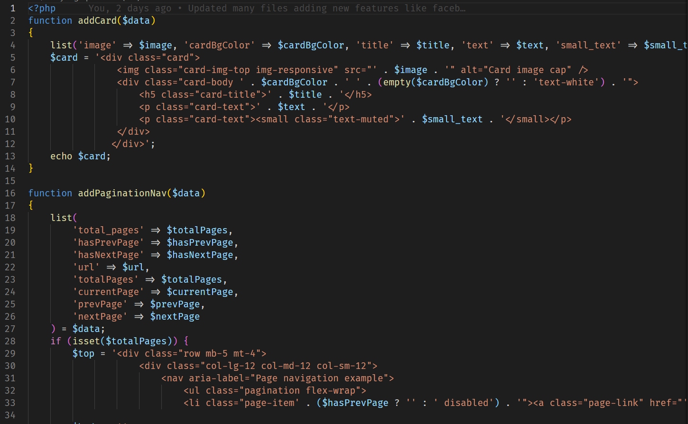

# Simple MVC Framework

This is a very small framework based on Brad Traversy's [Udemy course](https://www.udemy.com/share/101Zcs3@glIxZUWZNdpB_oEkbhKFBV0iCzgCXKdE92_ch-T4V9gNxQtNKDGq1_mkAXpoAvq2/)

and creating it mainly for studiyng purpose. It is based on MVC pattern and it is suitable for fast creating small projects, trying different ideas, conceptions etc..

I had updated slightly this version from the original of the Brad from his course. I added also some stuffs like

composer, facebook and google login buttons, different helper functions in helpers folder, user's settings page where you can change your profile photo, reset the password, change the password or to delete permamently your account. Refactored a little the registration and login logic. Updated the main views adding more icons.

# What are you need to run this locally?

1.Working server + PHP + MySQL /you can install packages separately or use xampp, wampp etc.../ and composer installed to install dependencies in composer.json

2.Database and tables. The settings are in config file. You must create database about this project /using phpmyadmin, heidiSQL etc.../

and then you must have a users table. I uploaded this table in sql executable file in db tables folder.

/There are some example or testing data and you can delete it when you want. All testing users are with passwords 1234567/

3.You must your own settings here or to use the default one. For sending emails, Facebook login and
Google login there are no default settings available. If you want to use these features you must create an app in facebook or google firstly. You can follow their documentation.
Other example settings are given below on the image.

4. You must change .htaccess in public directory adding your project folder name.

5. Install all dependencies with composer - you can turn on terminal in the current project directory ant to run
   composer install in the command line. Then the installation must begin.

Before installing the dependencies you can check them in composer.json file

and if you don't need you just can delete some of them. If you like to use any of them you must firstly execute
composer install in the console/command prompt in the current directory. Where the composer.json file is located.

6.Next final step is to trying to run project. Try to open http://localhost/mvcframework in your browser. If everything is ok you must see like the following image

From the db tables folder , if you executed the .sql file, you must have default table users with some testing users.

If you want to explore more you can use one of the three testing accounts:

* owner_test@gmail.com
* admin_test@gmail.com
* user_test@gmail.com

All users default password is 1234567.

**assets** folder is not a part from the project. It just contains images from the readme file used by the markdown editor to show them. You can delete it after download the project together with the Readme.md

# About Project Structure

1. Everything start from the index.php in the main directory. There the main Core class is called from the bootstrap.php

   

   In bootstrap.php the main core classes, configuration file and the helper functions are loaded

   

   The helpers are just a small functions to help you with the logic. They can be used in models, controllers and in the views. In the following image I am showing example of the content_helpers.php file

   

   You can see that there are two functions to help me with the content - the first one is for adding bootstrap cards
   And the second one to help me with the pagination.

   Of course you can freely remove or adding yours. If you don't want to use some of them you just can delete firstly their reference in bootstrap.php and then delete the helper file you don't need. And contrary... if you want to use your own firstly you must add the file in helpers folder and then to add reference in bootstrap.php like the image on bootstrap.php file.

2.The Core class handle actions about loading the necessairy controller, calling the necessairy method from the selected controller and to pass it data from the url. Firstly, the url is splitting by '/' and the first data in array is the name of the controller and the second one the name of the method of this controller. So, if the method is not found from the controller then the default one index will be loaded. If the default index method not exists then the error will be thrown.
